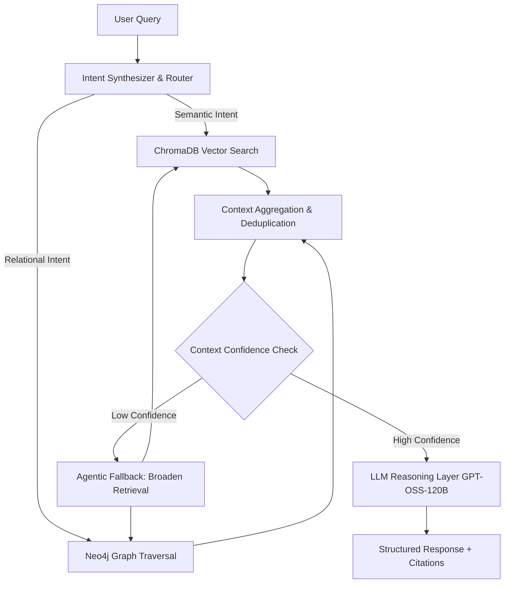

<div align="center">

# ⚖️ LegalAI

**Graph-Augmented Hybrid RAG for Complex Legal Reasoning**

[](https://legalaifrontend.vercel.app/)


</div>

LegalAI is a production-grade reasoning engine designed to solve the structural limitations of standard RAG in highly structured domains like law. By orchestrating vector semantics with graph-based legal relationships and agentic fallback strategies, LegalAI answers multi-hop legal queries with high determinism.

---

## 🚀 The Core Problem

Traditional pure-vector RAG systems inherently fail in complex legal use cases:
1. **Multi-Hop Blindspots:** Law relies on cascading relationships (e.g., *Case A cites Case B which invalidates Section C*). Cosine similarity fails to traverse these deterministic bounds.
2. **Missing Structured Context:** Legal data is heavily graph-structured.
3. **High Hallucination Risk:** Without deterministic grounding, LLMs frequently confabulate precedents.

**LegalAI solves this by unifying semantic search with deterministic graph traversal.**

---

## 🧠 System Architecture

Our agentic pipeline is orchestrated via **LangGraph**, providing failure-aware routing, parallelized retrieval, and iterative context synthesis.



---

## ⚡ Key Engineering Differentiators

### 1. Hybrid Retrieval Engine (Vector + Graph)
Combines the fuzziness of embedding search with the rigidity of Cypher graph queries. Resolves complex questions such as, *"Which precedents overturn Section 420 in recent commercial rulings?"*

### 2. Failure-Aware Agentic Orchestration
Standard pipelines break silently on poor retrieval. LegalAI implements **LangGraph-driven cyclical workflows** that detect empty/conflicting retrievals, automatically relaxing search constraints or querying secondary agents until a confidence threshold is met.

### 3. Hyper-Optimized Latency
- **Parallel Fetching:** Vector and Graph pipelines execute concurrently to avoid sequential bottlenecking.
- **Query Pruning:** Simple single-hop queries bypass the intensive graph traversal hot-path using early exit patterns.
- **Redis Caching:** Transparent, multi-tiered caching for high-frequency sub-queries.

---

## 📊 Performance & Evaluations

Evaluated against a custom-curated, multi-hop legal QA dataset.

| Query Complexity | Accuracy (Exact Match) | Latency (P95) |
|------------------|------------------------|---------------|
| **Single-hop**   | 98%                    | 850ms         |
| **Multi-hop**    | 93%                    | 1.8s          |

*Note: The agentic optimization layer reduced average response time by **~7 seconds** compared to baseline naive RAG implementations.*

---

## 🛠️ Technology Stack

* **Core Backend:** Python, Flask, FastAPI
* **Agentic Orchestration:** LangGraph, LangChain
* **Large Language Models:** GPT-OSS-120B
* **Vector Store:** ChromaDB
* **Knowledge Graph:** Neo4j (AuraDB)
* **Caching Layer:** Redis
* **Frontend Integration:** [Next.js / React UI](https://legalaifrontend.vercel.app/) hosted on Vercel

---

## 📂 Repository Structure

```text
legalai-backend/
├── app/
│   ├── agents/          # LangGraph state machines and workflow nodes
│   ├── retrieval/       # Vector search implementations (ChromaDB)
│   ├── graph/           # Cypher query generation & Neo4j integration
│   ├── evaluation/      # Dataset metrics, latency profiling scripts
│   └── api/             # REST endpoints connecting to the agent cluster
├── tests/               # Unit, integration, and end-to-end system tests
├── docs/                # Architecture diagrams and system configuration
└── config/              # Environment profiles and infra bindings
```

---

## 🛡️ Limitations & Roadmap

- **Graph Completeness:** Quality is heavily reliant on continuous ingestion and schema integrity of the Neo4j deployment.
- **Automation:** Planning autonomous web-scraping agents to update the Knowledge Graph directly.
- **Scoring:** Confidence calibration using LLM-derived log-probs for individual citations.
- **Explainability Layer:** Transparent breakdown showing exactly *why* certain nodes were selected.

---

## 🤝 Let's Connect

Architected and developed by **Avinash Bhurke**.   
I build high-performance data systems, scalable backends, and intelligent AI architectures. Let's discuss engineering!

📧 [avinashbhurke8@gmail.com](mailto:avinashbhurke8@gmail.com)  
🌐 **Live Application:** [LegalAI Platform](https://legalaifrontend.vercel.app/)  
📍 Pune, India

<div align="center">
  <b>⭐ If this architecture inspired you, please consider starring the repository. ⭐</b>
</div>
